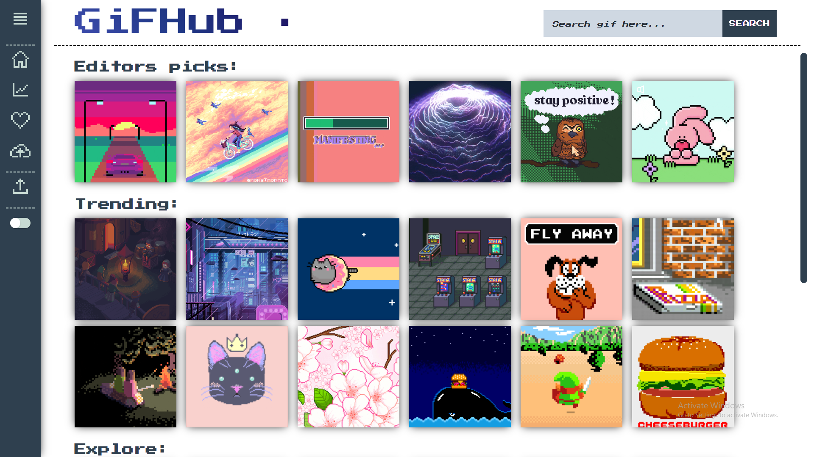
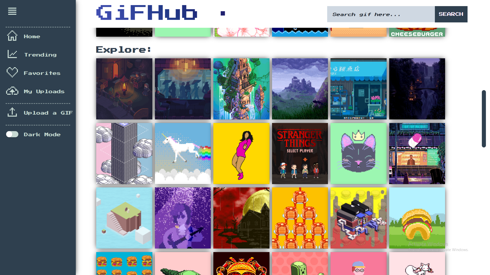
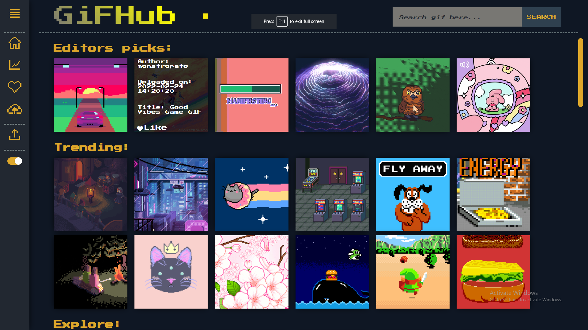
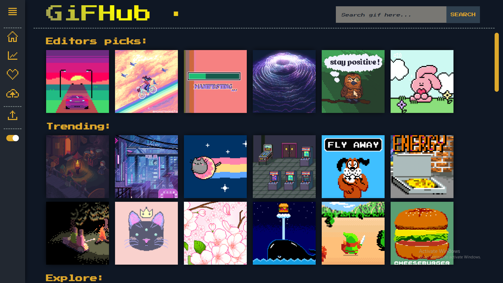
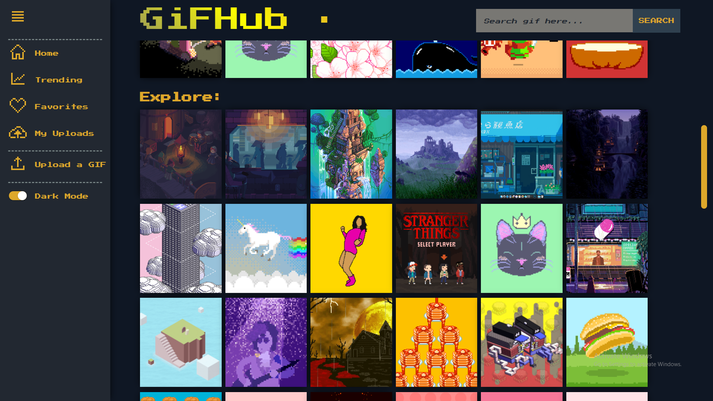
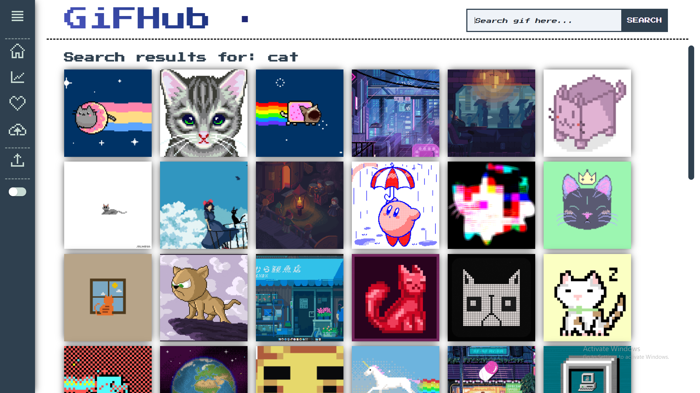
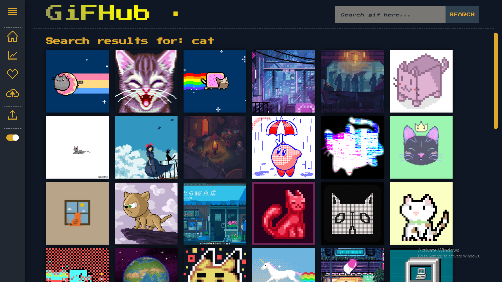

# Team 7 Web Project

---

## Welcome to our first Web Project in the Academy.

### 1. We are Team 7, and we are pleased to present you our single page gif application.

The application focus lays on the **pixel world of gifs**, which makes it not an ordinary one.

For the build we used pure **HTML**, **CSS** and **JS** , of course.

There aren't any external libraries, because as this being our first shot in the project making, we tried to get the most out of the languages.

### 2. Project information

- Language and version: **JavaScript ES2020**
- Platform and version: **Node 14.0+**

# GiFHub

---

